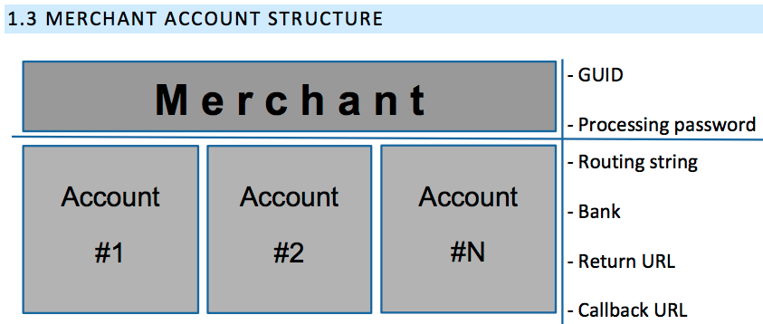

[](https://badge.fury.io/rb/transact_pro)
[](https://circleci.com/gh/CreativeGS/transact_pro/tree/master)
[](https://coveralls.io/github/CreativeGS/transact_pro?branch=master)

# TransactPro
Lightweight Ruby wrapper for communicating with TransactPro 1stpayments.net card payment API.  

### What can this gem do?
Currently core functionality is supported - single and recurring SMS payments with card details entered gateway-side (zero hassle with [PCI compliance](https://www.pcisecuritystandards.org)), payment outcome check request and refund request.     
As of v1.0.0 (2018-01-04) the full functionality status list is:

| Functionality  | method name | Page in doc  | Support in gem  | response data  |
|---|---|---|---|---|
| SMS transaction init, card details entered merchant-side | *init | 12 | ✗ | - |
| SMS transaction init, card details entered gateway-side | *init | 21 | ✓ | `tid` & `redirect link` |
| SMS transaction init with card data save flag, card details entered gateway-side | *init_recurring_registration | 42 | ✓ | - |
| DMS init, card details entered merchant-side | make_hold | 37 | ✗ | - |
| DMS init, card details entered gateway-side | init_dms | 37 | ✗ | - |
| DMS execute | charge_hold | 37 | ✗ | - |
| Save card details for subsequent recurring payments, details entered gateway-side | init_store_card_sms | 45 | ✗ | - |
| Recurrent SMS, init a recurring payment | init_recurrent | 46 | ✓ | TODO |
| Recurrent SMS, execute a recurring payment | charge_recurrent | 48 | ✓ | TODO |
| Credit transaction init | init_credit | 17 | ✗ | - |
| Credit transaction execute | do_credit | 17 | ✗ | - |
| P2P transaction init | init_p2p | 18 | ✗ | - |
| P2P transaction execute | do_p2p | 18 | ✗ | - |
| MOTO transaction init | **moto_init | 48 | ✗ | - |
| MOTO payment execute | **moto_charge | 48 | ✗ | - |
| Payment cancellation | cancel_request | 23  | ✗ | - |
| DMS cancellation | cancel_dms | 38 | ✗ | - |
| Payment execution (charge) | charge | 24 | ✗ | - |
| Payment status request | status_request | 31 | ✓ | TODO |
| Payment refund | ***refund | 34 | ✗ | "Refund Success" |
| Card verification | verify_card | 39 | ✗ | - |
| Terminal Limits | get_terminal_limits | 41 | ✗ | - |
| Reconciled Transactions | rt_api | 43 | ✗ | - |

*init request is the same for both card data entry strategies, since the receiving Merchant __Account__ determines what sort of response to give.     
**moto methods are recurring payments performed on card data saved in a special manner. They use `init` and `charge` endpoints with tweaked parameters.  
***refunding can be done via the panel in merchantarea.  

## Installation
Bundle or manually install the latest version of the gem:

```ruby
gem 'transact_pro'
```

## Usage
The gem implements `gateway`, `request` and `response` objects that handle communication with the remote API for you.  
All communication is done synchroniously and without failsafes, so if something goes wrong during the remote request (HTTP timeout etc.), you get the raw error and get to handle it.  

Please note that in this gem all configuration option hash keys are constant-case symbols like `:GUID` whereas all parameter keys for requests to the API are snake-case symbols like `:merchant_transaction_id`.

### 1. `TransactPro::Gateway`



The gateway object encapsulates a _Merchant_ with GUID and a password, and at least one _Account_ with a routing string.  

To this end, initialize gateway instances like so:

```rb
options = {
  TEST: false, # defaults to false, pass `true` if you want the gem to make requests to the sandbox endpoints 
  API_URI: "https://something.new" # gem has the endpoint uri in defaults, you may only need this if the domains used suddeny change
  GUID: "CAZY-7319-WI00-0C40", # mandatory
  PASSWORD: "g44B/pAENO2E", # mandatory
  ACCOUNT_3D: "CS01", # default routing string of Account to be used for 3D transactions
  ACCOUNT_NON3D: "CS02", # default routing string of Account to be used for non-3D transactions
  ACCOUNT_RECURRING: "CS03", # default routing string of Account to be used for recurring payment execution
  custom_return_url: "https://www.example.com/pay/transactpro/response?merchant_transaction_id=ZZZZZZZ" # can be overridden in transaction init request
  custom_callback_url: "https://www.example.com/pay/transactpro/response?merchant_transaction_id=ZZZZZZZ" # can be overridden in transaction init request
}

gateway = TransactPro::Gateway.new(options)
```

### 2. `TransactPro::Request`

Use the `Gateway` instance's `#request` method to perform requests.  

```rb
options = {
  method: :status_request, # mandatory, exclusively symbol objects for value
  request_type: 'transaction_status',
  init_transaction_id: "abc123",
  # Note that passing :guid and :pwd is possible and `#call` will always override any defaults with the latest passed values, but generally you should rely on these values being set correctly from GUID and PASSWORD in gateway configuration. 
  guid: "..."
  pwd: "..."
  # Note that :rs is optional and will be inferred from gateway defaults, preferring 3D accounts to NON3D, where applicable.
  rs: "..."
}

request_instance = gateway.request(options)
request_instance.call #=> response

# TransactPro::Request instances also have #to_s method to inspect what parameters are used in the request.
```

### 3. `TransactPro::Response`
`Response` objects are thin wrappers around the response bodies received from communicating with the TransactPro API.  
Use `#to_s` on them to get the raw body and do any handling yourslef.   
The gem provides a couple methods for ease of use:

```rb
response = request_instance.call

response.redirect_link #=> "https://..." link to redirect users to for checkout, nil if not applicable

response.status #=> "OK" if all went well, "FAIL" if a payment status response and it did not go through, "ERROR" if API said request was bad

response.tid #=> the 40-symbol long hexdigit transaction ID, nil if not applicable

response.to_s #=> raw body

response.to_h #=> splits the response on "~" and then on first ":" to make key-value pairs, string keys!
```

## Contributing
Bug reports and pull requests are welcome on GitHub at https://github.com/CreativeGS/transact_pro. This project is intended to be a safe, welcoming space for collaboration, and contributors are expected to adhere to the [Contributor Covenant](http://contributor-covenant.org) code of conduct.

The project uses TDD approach to software development, follow these steps to set up:
1. fork and clone the repo on github
2. Install appropriate Ruby and Bundler
3. `bundle`
4. See if all specs are green with `rspec`
5. (optional) Run specs with `USE_LIVE_SANDBOX=true rspec` to disable mocking of remote requests and make live requests to sandbox instead.  
5. TDD new features
6. Make a Pull Request in github

## Releasing a new version

```
gem push # to set credentials
rake release
```

## License

The gem is available as open source under the terms of the [BSD-3-Clause License](https://opensource.org/licenses/BSD-3-Clause).

## Code of Conduct

Everyone interacting in the TransactPro project’s codebases and issue trackers is expected to follow the [code of conduct](https://github.com/CreativeGS/transact_pro/blob/master/CODE_OF_CONDUCT.md).
